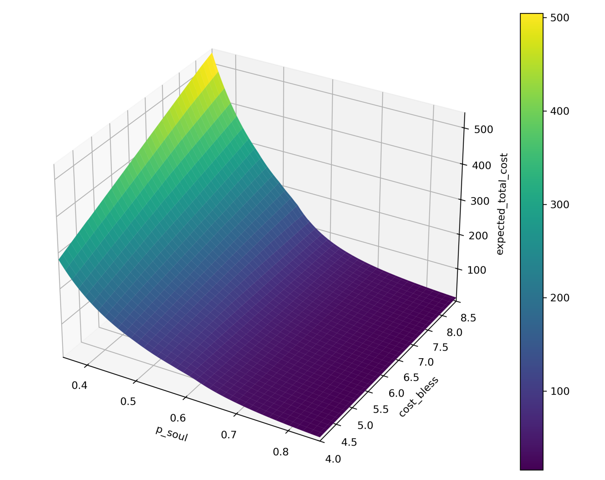
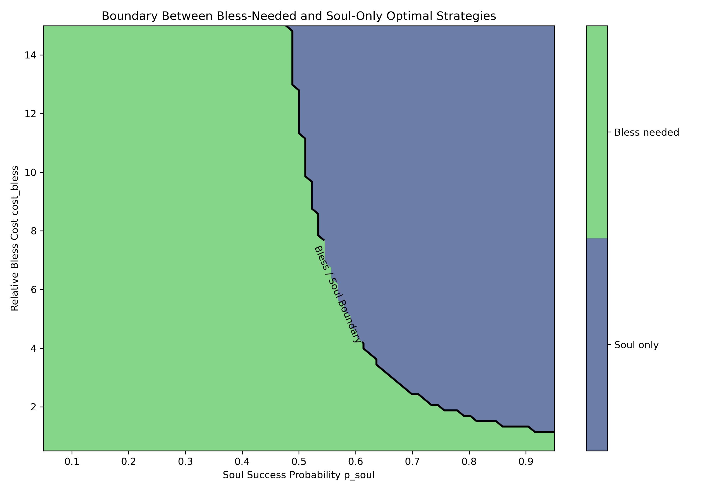
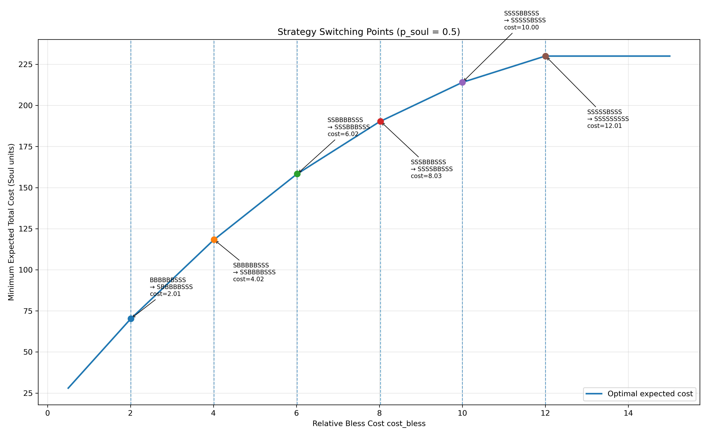
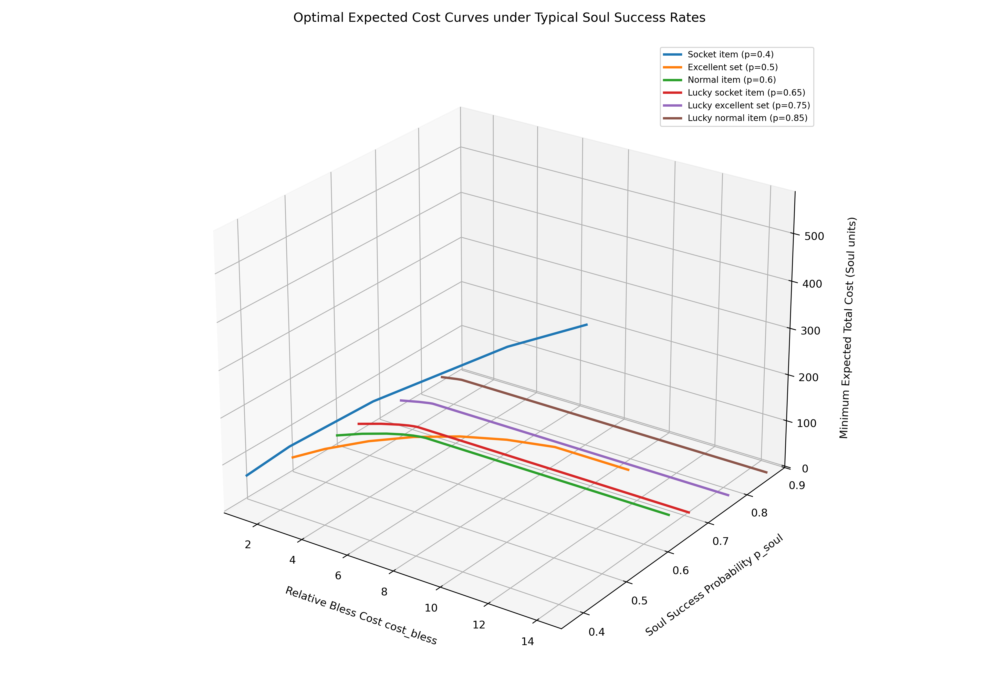

# Probabilistic Optimization of MU Online Item Upgrades  
### A Markov Chain and Bellman-Based Approach

---
- [Simple Case: Quick Intuition and Basic Understanding](Simple_Case.md)

- [**Results: All**](Results_Collection.md)

- [Theory: +0 to +9 Upgrade Markov Model (Soul Gems Only, Any Success Rate)](Calculator_MK1.md)

- [Theory: +0 to +9 Upgrade Bellman + Markov Model (Soul & Bless Gems, Any Success Rate, Any Strategy, Any Relative Cost)](Calculator_MK2.md)

- [Code: +0 to +9 Upgrade – Enumerate All Strategies, Compute Expected Cost, and Rank Optimal (Soul & Bless Gems, Any Success Rate, Any Strategy, Any Relative Cost)](item_upgrade_to_lvl_9_Bellman_calculator.py)

- [Code: +0 to +9 Upgrade – Expected Cost Calculation (Soul Gems Only, Any Success Rate)](item_upgrade_to_lvl_9_markov_chain_calculator.py)

- [Code: +0 to +7 Upgrade – Expected Cost Calculation (Soul Gems Only, Any Success Rate)](item_upgrade_to_lvl_7_markov_chain_calculator.py)

- [Code: +0 to +6 Upgrade – Expected Cost Calculation (Soul & Bless Gems, Any Success Rate, Any Strategy, Any Relative Cost)](item_upgrade_to_lvl_6_Bellman_calculator.py)

- [Code: +0 to +9 Upgrade – Optimal Strategy Cost Curve with Switching Points (Soul & Bless Gems, Fixed Success Rate, Any Strategy, Any Relative Cost)](strategy_switching_cost_curve.py)

- [Code: +0 to +9 Upgrade – Multi-Curve 3D Optimal Strategy Visualization (Multiple Typical Success Rates, Soul & Bless Gems)](Multi_p_cure.py)

---
## 1. Problem Statement

In *MU Online*, upgrading equipment from **+0 to +9** involves stochastic success/failure mechanisms and multiple resource types:

- **Soul Gems**: probabilistic success, low cost  
- **Bless Gems**: deterministic success, high cost  

Players must decide:

> *At each upgrade stage, which resource should be used to minimize total expected cost?*

This problem becomes non-trivial due to:

- stochastic state transitions  
- nonlinear failure penalties  
- combinatorial strategy space  
- varying economic conditions across servers  

---

## 2. Methodology

### 2.1 Markov Chain Modeling

The upgrade process is modeled as an **absorbing Markov chain**:

- States: +0 → +9  
- Transient states: +0 → +8  
- Absorbing state: +9  

Failure rules:

- +0: stays at 0  
- +1 ~ +6: drop by 1 level  
- +7, +8: reset to +0  

The expected number of visits is computed using:

\[
N = (I - Q)^{-1}
\]

---

### 2.2 Strategy Space

- Decision stages: +0 → +6  
- Total strategies:  
\[
2^6 = 64
\]

Each strategy defines whether to use:

- B (Bless) or  
- S (Soul)

---

### 2.3 Bellman Perspective

Although solved via enumeration, the structure follows:

> **Optimal substructure + cost minimization**

Each state implicitly satisfies a Bellman equation:

\[
V(i) = \min \{ C_B + V(i+1),\; C_S + p V(i+1) + (1-p)V(f(i)) \}
\]

---

## 3. Results

### 3.1 Optimal Cost Surface

- X-axis: Soul success probability \( p_{soul} \)  
- Y-axis: Relative Bless cost  
- Z-axis: Expected total cost (in Soul units)  

This surface represents:

> the expected resource consumption under optimal strategy

---

### 3.2 Strategy Phase Boundary

- Regions:
  - **Soul only**
  - **Bless needed**

The boundary reveals:

> when deterministic upgrades (Bless) become economically justified

---

### 3.3 Strategy Switching Curve

For fixed \( p_{soul} \):

- X-axis: Bless cost  
- Y-axis: expected cost  

Vertical transitions indicate:

> **discrete optimal strategy changes**

---

### 3.4 Multi-Curve Comparison

Multiple curves for typical equipment:

- Socket: p = 0.40  
- Excellent: p = 0.50  
- Normal: p = 0.60  
- Lucky variants: higher success rates  

---

## 4. Key Insights

### 4.1 Nonlinear Cost Structure
Expected upgrade cost is highly nonlinear with respect to:
- success probability  
- resource pricing  

---

### 4.2 Strategy Phase Transition
Optimal strategies change discretely:

> continuous parameters → discrete policy shifts  

---

### 4.3 Bless Usage Threshold
There exists a critical boundary:

- below threshold → Soul only  
- above threshold → mixed strategy  

---

### 4.4 Economic Interpretation

The system behaves like a **risk-cost tradeoff model**:

- Soul = risky but cheap  
- Bless = safe but expensive  

Optimal policy balances:

> variance vs expectation

---

## 5. Code & Implementation

- Full strategy enumeration (64 strategies)  
- Matrix-based expectation computation  
- Parameter sweep & visualization  

---

## 6. Applications

This framework can be extended to:

- other game upgrade systems  
- stochastic resource optimization  
- reinforcement learning benchmarks  
- decision theory teaching examples  

---

## 7. Repository Structure

- Theory: Markov / Bellman derivations  
- Code: calculators & visualization tools  
- Results: precomputed data and figures  

---

## 8. Conclusion

This project provides:

> a complete probabilistic decision framework for item upgrades

Combining:

- Markov chains  
- dynamic programming concepts  
- computational enumeration  

it transforms a heuristic gameplay problem into a **quantitative optimization model**.

---

## Author

Razz  
MIT License
